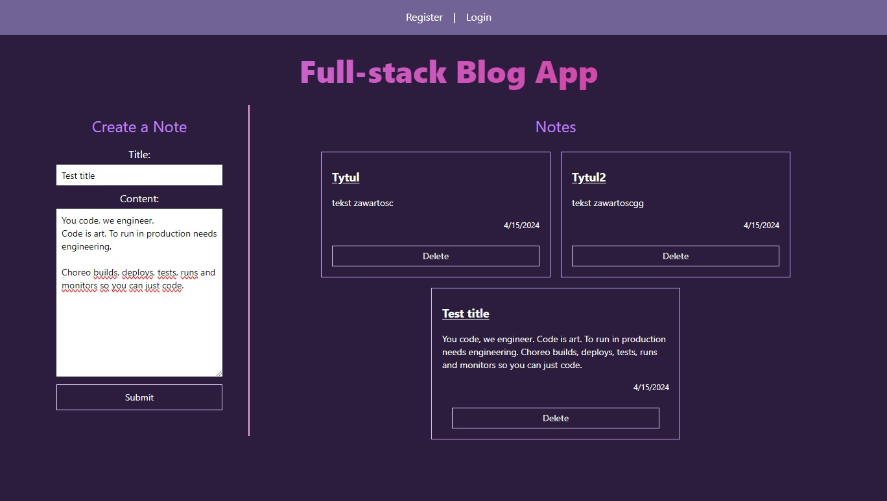
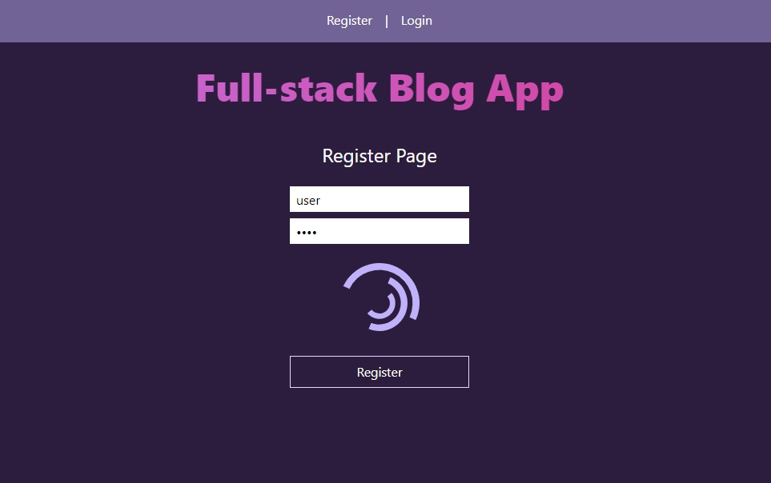

<p align="center">
    
    
    
    
    
</p>

<h1 align="center">Full-stack Blog App</h1>

<p align="center">Full-stack Blog Web App written using:</p>
<p align="center" style="margin: 0;">• React.js, Tailwind CSS as a front-end</p>
<p align="center">• Django & Python as a back-end</p>

## Technologies

Used technologies:

- Python
- Django
- React.js
- Tailwind CSS

Front-end part of this project was created with tool named:

- Vite

Used also:

- axios
- react-router-dom
- jwt-decode
- react-loader-spinner

## How to run this full-stack app?

- _Firstly clone this project to your local IDE_

Type:

```bash
git clone https://github.com/goldipl/Django-React-Blog.git
```

- _Secondly run back-end_

Type:

```bash
python3 -m venv venv
venv/Scripts/activate (if doesnt work on windows: Set-ExecutionPolicy Unrestricted -Scope Process)
cd backend
pip install -r requirements.txt
```

Remember to make migrations

```bash
python manage.py makemigrations
python manage.py migrate
```

start backend:

```bash
python manage.py runserver
```

Development server will run at:

```bash
http://127.0.0.1:8000/
```

- _Thirdly, split terminal, change direction to frontend and run the front-end part using commands below_

Type:

```bash
cd frontend
```

After it install all packages, typing:

```bash
npm i
```

Now you can run your front-end part typing:

```bash
npm run dev
```

and go to development server:

```bash
http://localhost:5173/
```

## Screenshots




## Source & inspired by

[Tech With Tim](https://github.com/techwithtim/Django-React-Full-Stack-App)

Additional funcionalities coded by [me](https://github.com/goldipl)
